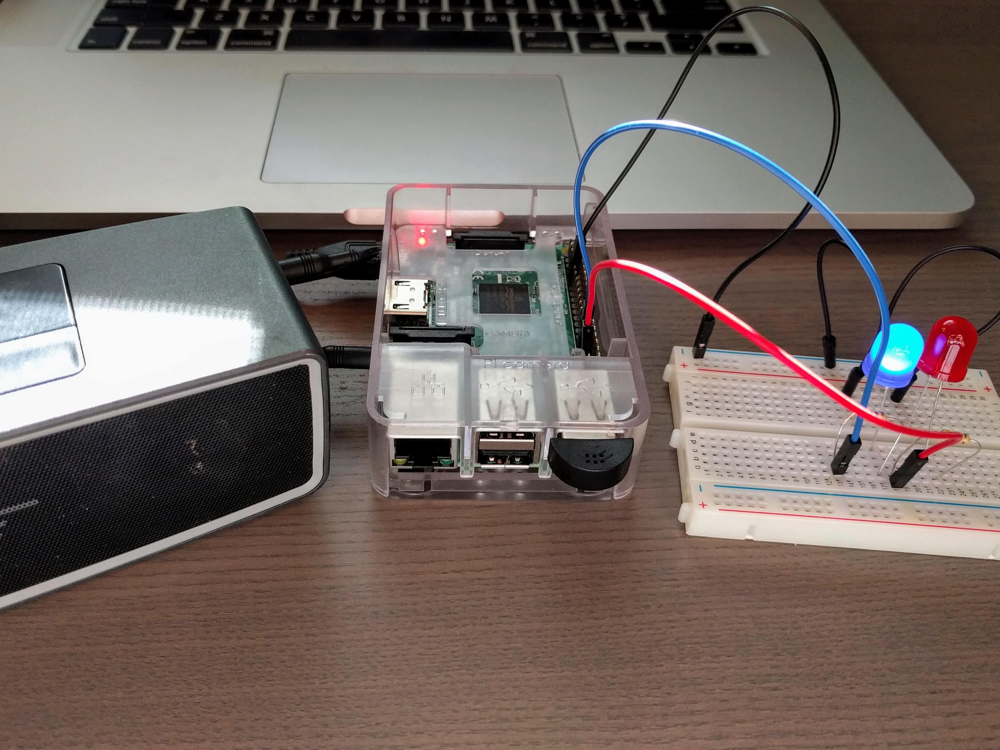
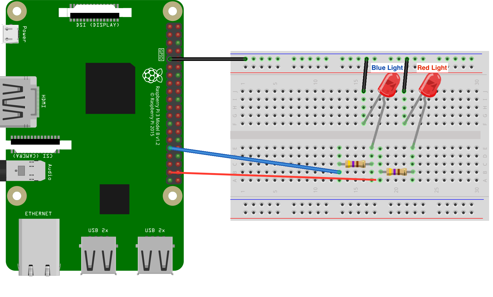
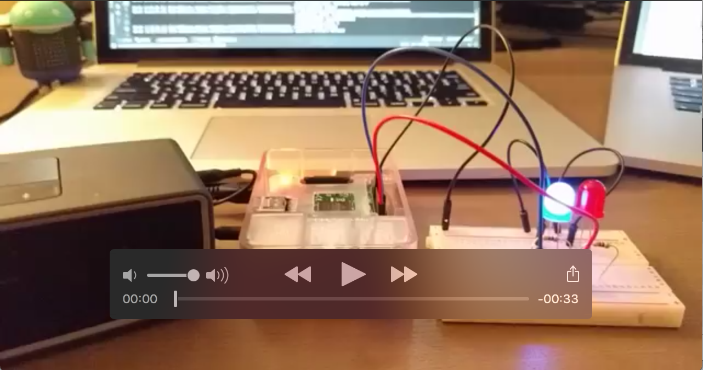

### Android Things & The Google Assistant

The attached project is a sample Android Things project to create your own Google Home like device. The device will respond to the activation phrase of "hey CapTech" and be able to process requests to the Assistant. The Assistant device will need a Google Cloud project set up and credentials to access user specific information. The steps to set up the project and create these credentials are below: 

- Enable the following [activity controls](https://myaccount.google.com/activitycontrols) in the Google Account you plan to use with the Assistant: Web & App Activity, Device Information, and Voice & Audio Activity. This will be the acccount you want to allow the Assistant retrieve information such as calendar events from. This does not have to be a developer account. 
- In the Cloud Platform Console, go to the [Projects page](https://console.cloud.google.com/project). Select an existing project or create a new project.
- Enable the [Google Assistant API](https://console.developers.google.com/apis/api/embeddedassistant.googleapis.com/overview) on the project you selected.
- [Create an OAuth Client ID](https://console.developers.google.com/apis/credentials/oauthclient)
- Click Other (select Other UI and User data if prompted) and give the client ID a name.
- On the OAuth consent screen tab, give the product a name (don't use "Google" in the name) and a description.
- Click ⬇ (at the far right of screen) for the client ID to download the client secret JSON file (client\_secret\_NNNN.json or client_id.json).
- Open a terminal and install the google-auth-lib command line tool:

```
$ pip install google-auth-oauthlib[tool] --user
```
- Navigate to your top-level project directory.
- Use the google-oauthlib-tool command line tool to grant the permission to use the Assistant API to your application and create a new credentials.json file in your app resource directory.

```
$ cd <project-directory-name>
$ google-oauthlib-tool --client-secrets path/to/client_secret_NNNN.json \
                       --credentials app/src/main/res/raw/credentials.json \
                       --scope https://www.googleapis.com/auth/assistant-sdk-prototype \
                       --save                       
```
- Replace path/to/client\_secret\_NNNN.json with the path of the JSON file you downloaded in step 10. 

The above steps will output the credentials file required.

Once you move past the prototyping phase, you can find details [here](https://developers.google.com/identity/protocols/OAuth2) on using OAuth 2.0 to Access Google APIs. 


###Required Hardware

- Raspberry Pi 3 device with Android Things flashed on it
- microphone, this project leverages this one from [Amazon](https://www.amazon.com/gp/product/B00IR8R7WQ/ref=oh_aui_detailpage_o06_s00?ie=UTF8&psc=1)
- A standard speaker with 3.5mm headphone jack



###Expected Lighting


###Demo
[](https://goo.gl/photos/M82Cm7wynWDL9ppZ7)

###License

Licensed to the Apache Software Foundation (ASF) under one or more contributor license agreements. See the NOTICE file distributed with this work for additional information regarding copyright ownership. The ASF licenses this file to you under the Apache License, Version 2.0 (the "License"); you may not use this file except in compliance with the License. You may obtain a copy of the License at

[http://www.apache.org/licenses/LICENSE-2.0](http://www.apache.org/licenses/LICENSE-2.0)

Unless required by applicable law or agreed to in writing, software distributed under the License is distributed on an "AS IS" BASIS, WITHOUT WARRANTIES OR CONDITIONS OF ANY KIND, either express or implied. See the License for the specific language governing permissions and limitations under the License.